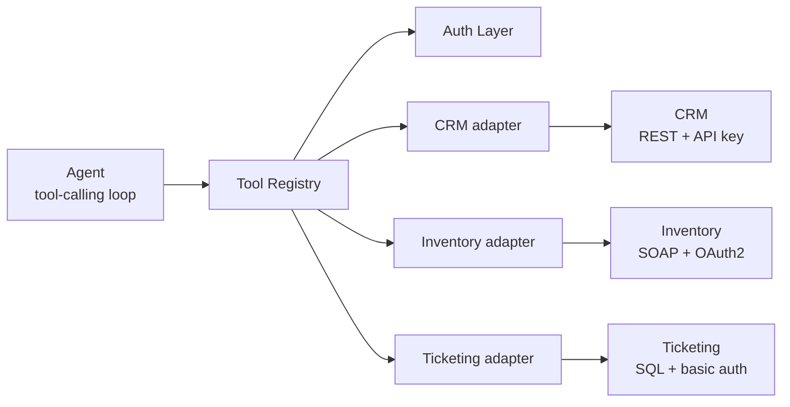

<div align="center">

# Heptapod

**One tool interface for LLM agents across REST, SOAP, and SQL backends.**

Authentication (API key, OAuth2 client credentials, HTTP basic) is translated underneath,<br>
so agent code never changes per system, and adding a system never changes the agent.

[](https://github.com/swap-mitra/heptapod/actions/workflows/ci.yml)
[](https://www.python.org/downloads/)
[](LICENSE)

[Quick start](#quick-start) · [How it works](#how-it-works) · [Adding a backend](#adding-a-backend) · [Contributing](CONTRIBUTING.md)

</div>

## Contents

- [Why Heptapod](#why-heptapod)
- [How it works](#how-it-works)
- [Requirements](#requirements)
- [Quick start](#quick-start)
- [Configuration](#configuration)
- [Running the agent](#running-the-agent)
- [Included backends](#included-backends)
- [Using Heptapod as a library](#using-heptapod-as-a-library)
- [Authentication](#authentication)
- [Errors and logging](#errors-and-logging)
- [Adding a backend](#adding-a-backend)
- [Development](#development)
- [Troubleshooting](#troubleshooting)
- [Project status](#project-status)
- [About the name](#about-the-name)
- [Contributing](#contributing)
- [License](#license)

## Why Heptapod

Most agent pilots stall on integration rather than model quality. Real organizations run systems built decades apart, each with its own protocol and its own authentication model, and that plumbing usually gets rebuilt from scratch for every client and every system.

Heptapod is the reusable layer underneath: one contract that every backend implements, one registry the agent talks to, and one auth layer that turns a declared scheme (API key, OAuth2 client credentials, HTTP basic) into request credentials. A new system is one adapter class plus one config entry.

## How it works



| Component | Location | Responsibility |
| --- | --- | --- |
| Adapter contract | `core/adapter.py` | The `Adapter` protocol every backend implements, and `AdapterResult`, the structured result every call returns. |
| Tool Registry | `core/registry.py` | Loads adapters from `adapters.toml`, exposes each as one tool, resolves credentials, routes calls, and logs every call. |
| Auth Layer | `core/auth.py` | Turns an adapter's declared auth scheme into request headers. Caches and refreshes OAuth2 tokens. |
| Adapters | `adapters/` | One file per backend. Each translates a generic tool call into that backend's real request. |
| Agent | `agent/` | A plain tool-calling loop for Anthropic or OpenRouter models, plus the command-line entry point. |
| Mock backends | `mocks/` | Three standalone services with synthetic data and realistic quirks, run with Docker Compose. |

A single tool call flows like this:

1. The model calls a tool, for example `inventory` with `{"operation": "get_stock", "partNumber": "BP-310"}`.
2. The registry asks the auth layer for that adapter's credentials (here, a cached OAuth2 bearer token).
3. The adapter builds the backend request (here, a SOAP envelope), sends it, and parses the reply.
4. The registry logs the call and returns an `AdapterResult` to the agent, which passes it back to the model.

## Requirements

- Python 3.12 or newer
- Docker with Compose v2, to run the mock backends
- An API key for one LLM provider: [Anthropic](https://console.anthropic.com/) or [OpenRouter](https://openrouter.ai/keys) (OpenRouter offers free models)

## Quick start

```bash
git clone https://github.com/swap-mitra/heptapod.git
cd heptapod

python -m venv .venv
source .venv/bin/activate          # Windows: .venv\Scripts\activate
pip install -e ".[dev]"

cp .env.example .env               # then add your LLM key to .env
docker compose up -d --wait        # start the three mock backends
python -m agent "Customer Ada Lindqvist called. Find her open support ticket and check stock for the part it references."
```

To use OpenRouter's free models, set `HEPTAPOD_PROVIDER=openrouter` and `OPENROUTER_API_KEY` in `.env`. To use Anthropic, set `ANTHROPIC_API_KEY` and leave `HEPTAPOD_PROVIDER` unset.

## Configuration

### Environment variables

The command-line agent reads a `.env` file in the working directory (see `.env.example`). Variables already set in your shell take priority, and blank values are ignored. `.env` is gitignored; never commit it.

| Variable | Used by | Purpose |
| --- | --- | --- |
| `HEPTAPOD_PROVIDER` | agent | LLM provider: `anthropic` (default) or `openrouter`. |
| `HEPTAPOD_MODEL` | agent | Overrides the provider's default model. |
| `HEPTAPOD_CONFIG` | agent | Path to the adapter config. Default `adapters.toml`. |
| `ANTHROPIC_API_KEY` | agent | Anthropic credentials. An `ant auth login` profile also works. |
| `OPENROUTER_API_KEY` | agent | OpenRouter credentials. |
| `CRM_API_KEY` | CRM adapter and mock | API key for the CRM. |
| `TICKETING_USER`, `TICKETING_PASSWORD` | Ticketing adapter and mock | Basic auth login for the ticketing system. |
| `INVENTORY_CLIENT_ID`, `INVENTORY_CLIENT_SECRET` | Inventory adapter and mock | OAuth2 client credentials for the inventory system. |
| `TICKETING_RATE_LIMIT_EVERY` | Ticketing mock | Rate limit every Nth query with HTTP 429. Default `5`. |
| `INVENTORY_TOKEN_TTL` | Inventory mock | Lifetime of issued OAuth2 tokens, in seconds. Default `60`. |

The backend credentials in `.env.example` and `docker-compose.yml` are throwaway values for the local mocks only.

### Adapter config

`adapters.toml` registers the adapters. Each table is one adapter: `class` is its import path, and every other key is passed to its constructor.

```toml
[crm]
class = "adapters.crm:CrmAdapter"
base_url = "http://localhost:8001"
```

Secrets never go in this file. Each adapter names the environment variables it reads, and the registry resolves them at startup.

## Running the agent

```bash
python -m agent "<task in plain language>"
```

The agent loops until the model gives a final answer, then prints it. Each tool call is logged to stderr:

```
2026-10-04 17:05:51,163 core.registry ticketing.get_ticket ok 6.4ms
2026-10-04 17:05:51,163 agent.runtime tool ticketing input={"ticket_no": "T-9001", "operation": "get_ticket"} -> {"ticket_no": "T-9001", "cust_ref": "C-1001", "summary": "Bilge pump cycling continuously", "part_ref": "BP-310", ...}
2026-10-04 17:05:53,963 core.registry inventory.get_stock ok 26.0ms
```

### LLM providers

| Provider | `HEPTAPOD_PROVIDER` | Credentials | Default model |
| --- | --- | --- | --- |
| Anthropic | `anthropic` (default) | `ANTHROPIC_API_KEY`, or an `ant auth login` profile | `claude-opus-5` |
| OpenRouter | `openrouter` | `OPENROUTER_API_KEY` | `openrouter/free` |

`openrouter/free` routes each request to one of OpenRouter's free tool-capable models, so it keeps working when an individual free model is busy or withdrawn. Because it may pick a different model on each turn, pin one with `HEPTAPOD_MODEL` (for example `qwen/qwen3.8-27b:free`) when you need repeatable runs. Free models are rate limited; the client retries rate-limit and gateway errors a few times before failing.

On Anthropic, server-side refusal fallback is enabled: if the model declines a request, the API reruns it on a fallback model it selects.

### Example tasks

The mocks are seeded with linked synthetic data, so tasks can span systems:

- `Find customer C-1003 and list their open ticket ids`
- `Find Chen Wei in the CRM, list their open support tickets with summary and part, then assign ticket T-9004 to r.ito and mark it in_progress.`
- `Customer Ada Lindqvist called. Find her open support ticket, check inventory stock for the part it references, and update her email in the CRM to ada.l@lindqvist-marine.example.`

Writes persist until the mocks restart. Reset them with `docker compose restart`.

## Included backends

Three mock systems from unrelated domains, each with a different protocol, auth scheme, and real-world quirk. All data is synthetic.

### CRM (REST, API key)

Customer records with contact details and references to open tickets. Served on port `8001`.

- **Auth:** `X-API-Key` header from `CRM_API_KEY`.
- **Quirk:** list results are cursor-paginated two at a time. The adapter follows every cursor, so the agent always receives the complete list.

| Operation | Arguments | Returns |
| --- | --- | --- |
| `list_customers` | none | Every customer. |
| `get_customer` | `customer_id` | One customer. |
| `create_customer` | `name`, optional `email`, `phone` | The new customer, with its id. |
| `update_customer` | `customer_id`, any of `name`, `email`, `phone` | The updated customer. Only the given fields change. |

A customer is `{id, name, email, phone, open_ticket_ids}`.

### Ticketing (SQL, basic auth)

Support tickets in SQLite, reached over HTTP by posting one SQL statement with bound parameters. Served on port `8002`.

- **Auth:** HTTP basic from `TICKETING_USER` and `TICKETING_PASSWORD`.
- **Quirk:** every Nth query is rejected with HTTP 429 and a `Retry-After` header. The adapter waits and retries up to three times before returning the failure.
- **Safety:** every value reaches SQL as a bound parameter, never as SQL text. The database rejects invalid states through a `CHECK` constraint.

| Operation | Arguments | Returns |
| --- | --- | --- |
| `list_tickets` | optional `cust_ref`, `state` | Matching tickets. |
| `get_ticket` | `ticket_no` | One ticket. |
| `create_ticket` | `cust_ref`, `summary`, optional `part_ref` | The new ticket, opened with the next number. |
| `update_ticket` | `ticket_no`, any of `state`, `assigned_to` | The updated ticket. |

A ticket is `{ticket_no, cust_ref, summary, part_ref, state, assigned_to, opened_at}`. `state` is `open`, `in_progress`, or `closed`. `cust_ref` is a CRM customer id and `part_ref` is an inventory part number.

### Inventory (SOAP, OAuth2 client credentials)

Parts, stock levels, and warehouse locations behind a SOAP 1.1 service. Served on port `8003`.

- **Auth:** OAuth2 client credentials from `INVENTORY_CLIENT_ID` and `INVENTORY_CLIENT_SECRET`, exchanged at the service's own `/oauth/token` endpoint. Tokens are short-lived; the auth layer caches and refreshes them.
- **Quirk:** field names use this system's own camelCase (`partNumber`, `quantityOnHand`), unlike the other two systems. SOAP values are untyped, so numbers arrive as strings.

| Operation | Arguments | Returns |
| --- | --- | --- |
| `list_parts` | none | Every part: `partNumber`, `description`, `unitPriceUsd`. |
| `get_part` | `partNumber` | One part plus `totalOnHand` across warehouses. |
| `get_stock` | `partNumber` | `partNumber` plus `locations`, each with `warehouseCode`, `binLocation`, `quantityOnHand`. |
| `adjust_stock` | `partNumber`, `warehouseCode`, `delta` | `partNumber` plus the updated location. Stock cannot go below zero. |

## Using Heptapod as a library

The registry can be used directly, without an LLM:

```python
from core.registry import Registry

registry = Registry.from_config("adapters.toml")   # backend secrets must be in the environment

result = registry.call("inventory", {"operation": "get_stock", "partNumber": "BP-310"})
if result.success:
    print(result.data)    # {"partNumber": "BP-310", "locations": [...]}
else:
    print(result.error)   # e.g. "inventory returned HTTP 500: SOAP fault soap:Client: ..."

registry.tools()          # tool definitions (name, description, input_schema) for any LLM
```

To run the agent loop from code:

```python
import os

import anthropic
from agent.openrouter import OpenRouterClient
from agent.runtime import run_anthropic, run_openrouter

answer = run_anthropic("Find customer C-1003", registry, anthropic.Anthropic())
answer = run_openrouter("Find customer C-1003", registry, OpenRouterClient(os.environ["OPENROUTER_API_KEY"]))
```

Both loops take `model` and `max_turns` keyword arguments, and raise `RuntimeError` if the model stops unexpectedly (for example a refusal or a truncated reply) or exceeds `max_turns` (default 20).

## Authentication

Each adapter declares one scheme in its `auth_config`. Secrets are referenced by environment variable name, never embedded.

| Scheme | `auth_config` | Request credentials |
| --- | --- | --- |
| API key | `{"type": "api_key", "header": "X-API-Key", "secret_ref": "CRM_API_KEY"}` | The named header. |
| HTTP basic | `{"type": "basic", "username_ref": "...", "password_ref": "..."}` | `Authorization: Basic ...` |
| OAuth2 client credentials | `{"type": "oauth2_cc", "token_url": "...", "client_id_ref": "...", "client_secret_ref": "..."}` | `Authorization: Bearer ...`, cached per token URL and client, refreshed 10 seconds before expiry. |

The registry resolves every adapter's credentials once at startup, so a missing secret, an unknown scheme, or rejected OAuth2 client credentials stop the program immediately with a message naming the problem.

## Errors and logging

Adapters never raise. Every outcome is an `AdapterResult`:

```python
@dataclass
class AdapterResult:
    success: bool
    data: dict | None = None
    error: str | None = None
```

Invalid arguments, HTTP errors, SOAP faults, malformed responses, timeouts, and rate limits all come back as `success=False` with a readable `error`, which the agent passes to the model so it can correct itself. As a last line of defense, the registry converts any exception that escapes an adapter into a failed result and logs it with a traceback.

Startup problems are different: a bad `adapters.toml`, a missing secret, or a rejected OAuth2 client raise `ConfigError` or `AuthError` before the agent starts.

Every call logs one line from `core.registry` with the system, operation, latency, and outcome, so a failure can be traced to one adapter without reading the transcript.

## Adding a backend

A new backend is one adapter class, one `adapters.toml` table, and one test file. The registry, auth layer, agent, and existing adapters do not change.

**1. Write the adapter** in `adapters/<name>.py`. Its module docstring is its documentation: state the auth scheme, the secrets it reads, and each operation.

```python
"""Billing adapter (REST + JSON).

Auth: API key in the `X-Billing-Key` header. Secret: env var `BILLING_API_KEY`.

Operations:
- `get_invoice(invoice_id)`: one invoice.
"""

from typing import Any

from core.adapter import AdapterResult
from core.auth import Credentials


class BillingAdapter:
    name = "billing"
    description = "Billing system: invoices and payment status."
    input_schema = {
        "type": "object",
        "properties": {
            "operation": {"type": "string", "enum": ["get_invoice"]},
            "invoice_id": {"type": "string"},
        },
        "required": ["operation"],
        "additionalProperties": False,
    }

    def __init__(self, base_url: str):
        self.base_url = base_url.rstrip("/")
        self.auth_config = {"type": "api_key", "header": "X-Billing-Key", "secret_ref": "BILLING_API_KEY"}

    def execute(self, input: dict[str, Any], credentials: Credentials) -> AdapterResult:
        # Validate arguments, call the backend with `credentials` merged into the request
        # headers, and return an AdapterResult. Catch the backend's failures; never raise.
        ...
```

Conventions the existing adapters follow:

- One tool per backend, with a required `operation` enum.
- Validate required arguments before calling the backend.
- Use the standard library for HTTP (`urllib`) and XML (`xml.etree`).
- Keep the backend's own field names; the agent reconciles them.
- Use bound parameters for any SQL.

**2. Register it** in `adapters.toml`:

```toml
[billing]
class = "adapters.billing:BillingAdapter"
base_url = "http://localhost:8004"
```

**3. Test it** in `tests/test_billing.py` against its mock. The test suite fails if any adapter lacks its own test file.

## Development

### Tests

```bash
pytest
```

The suite needs neither Docker nor an LLM key. Adapter tests run each mock in-process on a real local port (`tests/conftest.py`), and agent loop tests replay scripted model responses.

### Continuous integration

GitHub Actions runs on every push and pull request: it installs the package on Python 3.12, starts the three mocks with `docker compose up --wait`, and runs the full test suite.

### Repository layout

```
core/              adapter contract, tool registry, auth layer
adapters/          one adapter per backend (crm.py, ticketing.py, inventory.py)
agent/             tool-calling loops, OpenRouter client, command-line entry point
mocks/             mock backends, one package each, plus a shared Dockerfile
tests/             unit tests for every module, adapter, and mock
adapters.toml      adapter registrations
docker-compose.yml mock backends for local runs and CI
.env.example       template for local configuration
```

## Troubleshooting

| Symptom | Cause and fix |
| --- | --- |
| `ConfigError: secret 'X' is not set in the environment` | A backend secret is missing. Copy `.env.example` to `.env` or export the variable. |
| `AuthError: OAuth2 token request to http://localhost:8003/oauth/token failed` | The inventory mock is not running. Start the mocks with `docker compose up -d --wait`. |
| `AuthError: ... was rejected: HTTP 401` | `INVENTORY_CLIENT_ID` or `INVENTORY_CLIENT_SECRET` does not match the mock's values in `docker-compose.yml`. |
| `HEPTAPOD_PROVIDER=openrouter needs OPENROUTER_API_KEY` | Add your OpenRouter key to `.env`. |
| `OpenRouter returned HTTP 429` | The free model is rate limited. Wait and retry, or pin a different model with `HEPTAPOD_MODEL`. |
| `docker compose up` fails with a port already in use | Another process holds port 8001, 8002, or 8003. Stop it, or change the host ports in `docker-compose.yml` and `adapters.toml`. |
| Unexpected data from an earlier run | The mocks keep writes in memory. Reset them with `docker compose restart`. |

## Project status

Version 0.1, in active development. All three backends, all three auth schemes, both LLM providers, and the full cross-system demo task work end to end. Next: an end-to-end integration test of the demo task in CI, driven by a scripted model.

## About the name

Heptapods are the aliens in *Arrival*, adapted from Ted Chiang's *Story of Your Life*. Their written language encodes meaning non-linearly, which makes understanding them a genuinely universal translation problem rather than a word-for-word swap. Translating between systems that were never designed to talk to each other is the problem this project works on.

## Contributing

Contributions are welcome. See [CONTRIBUTING.md](CONTRIBUTING.md) for setup and conventions, and [SECURITY.md](SECURITY.md) to report a vulnerability privately. Everyone taking part is expected to follow the [Code of Conduct](CODE_OF_CONDUCT.md).

## License

Released under the [MIT License](LICENSE).
