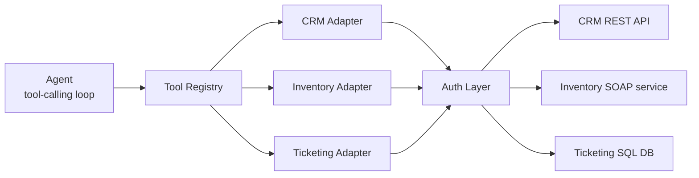
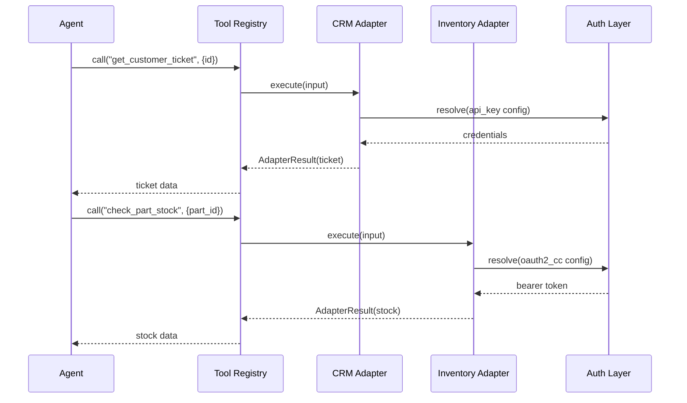

# High-Level Design — Universal System-Adapter Kit

## Architecture Overview

The agent never talks to a backend directly. It calls a Tool Registry, which resolves the right Adapter, which delegates credential handling to the Auth Layer before hitting the actual backend.



No backend-specific logic lives in the agent or the registry; everything system-specific is contained inside one adapter file.

## Core Components

| Component | Responsibility |
| --- | --- |
| Agent runtime | Single LLM tool-calling loop; decides which tool to call and with what arguments; knows nothing about backend protocols |
| Tool Registry | Loads adapter configs at startup, exposes each adapter's schema to the agent, routes a tool call to the right adapter |
| Adapter (x3) | One per backend; implements the shared interface; translates the agent's generic call into that backend's actual request |
| Auth Layer | Given an adapter's auth config, produces valid request credentials (API key header, OAuth2 token, basic auth header) without the adapter author writing auth code |
| Mock backends (x3) | Standalone services (REST, SOAP, SQL-backed) that stand in for real enterprise systems, each with realistic quirks |

## Adapter Contract

Every backend implementation satisfies the same `Adapter` protocol, so the registry and the agent never need backend-specific branches:

```python
class Adapter(Protocol):
    name: str
    description: str
    input_schema: dict          # JSON schema exposed to the agent as the tool's parameters
    auth_config: AuthConfig     # what the Auth Layer needs to authenticate this adapter's calls

    def execute(self, input: dict, credentials: Credentials) -> AdapterResult:
        """Perform the operation against the real backend and return a structured result
        or a structured error, never a raw exception."""
```

`AdapterResult` is a small dataclass (`success: bool`, `data: dict | None`, `error: str | None`) so a backend failure reaches the agent as data it can reason about, not a stack trace.

## Auth Translation Design

Each adapter declares an `auth_config` naming one scheme; the Auth Layer resolves it into request-ready credentials without the adapter author writing HTTP auth code.

| Scheme | Config shape | What the Auth Layer produces |
| --- | --- | --- |
| API key | `{type: "api_key", header: "X-API-Key", secret_ref: "CRM_API_KEY"}` | The header, value read from env/local vault |
| OAuth2 client-credentials | `{type: "oauth2_cc", token_url, client_id_ref, client_secret_ref}` | A cached bearer token, refreshed on expiry, injected as `Authorization: Bearer ...` |
| Basic auth | `{type: "basic", username_ref, password_ref}` | A base64-encoded `Authorization: Basic ...` header |

Secrets are referenced by name (`secret_ref`), never embedded in config files, and resolved through a small `SecretResolver` that reads env vars in v1 (a real vault integration is a drop-in replacement later, not a redesign).

## Request Flow

A slice of the demo task, looking up a customer's ticket (CRM) then checking the part it references (inventory), showing the same path through the registry and auth layer for two different backend types:



The agent's two calls are structurally identical even though one adapter speaks REST with an API key and the other speaks SOAP with OAuth2; that symmetry is the thing being demonstrated.

## Mock Backends

| Backend | Simulates | Protocol | Realistic quirks |
| --- | --- | --- | --- |
| CRM service | Customer records, contact info, open tickets | REST + JSON | Cursor-based pagination on list endpoints; API key auth |
| Inventory service | Parts, stock levels, warehouse locations | SOAP + XML | Field names differ from the CRM's conventions (`part_no` vs `partNumber`); OAuth2 client-credentials auth |
| Ticketing system | Support tickets, status, assignment | Direct SQL (SQLite/Postgres) | Occasional simulated rate-limit (429-equivalent) responses; basic auth |

Each runs as its own small service in `docker compose`, seeded with synthetic data on startup, so the demo never touches anything resembling real client data.

## Repo Layout & Tech Stack

```
adapter-kit/
  core/
    adapter.py        # Protocol + AdapterResult
    registry.py        # Tool Registry
    auth.py             # Auth Layer + SecretResolver
  adapters/
    crm.py
    inventory.py
    ticketing.py
  mocks/
    crm_service/        # REST mock, FastAPI
    inventory_service/  # SOAP mock, Spyne or zeep-server
    ticketing_service/  # SQL-backed mock, FastAPI + SQLite
  agent/
    runtime.py           # tool-calling loop
  tests/
  docker-compose.yml
  README.md
```

**Stack**: Python 3.12, FastAPI for the REST and SQL-backed mocks, a lightweight SOAP library for the inventory mock, the provider SDK directly for the agent's LLM calls (no LangChain, kept out unless the demo genuinely needs multi-turn planning), Docker Compose to run all three mocks together, pytest for adapter and registry tests.

## Extensibility

Adding a fourth backend (this is what Goal 2 in the PRD measures):

1. Write one adapter class implementing `Adapter`: `name`, `description`, `input_schema`, `auth_config`, `execute()`.
2. Add one entry to the registry's config file pointing at that adapter.
3. Write unit tests for the adapter against its own mock, independent of the agent.

No change to `registry.py`, `auth.py`, `runtime.py`, or any existing adapter. If step 1 or 2 ever requires touching shared code, that is a signal the interface itself needs revisiting, not that this backend is a special case.

## Testing & CI Strategy

- **Adapter tests**: each adapter is tested against its own mock backend with pytest, no LLM involved, so correctness is verifiable without spending API credits.
- **Registry tests**: confirm the registry loads all configured adapters and routes calls correctly, using fake adapters (no real mocks needed).
- **Agent integration test**: one scripted end-to-end run of the full demo task, gated in GitHub Actions on every push, catching regressions before they reach the demo video.
- **CI**: GitHub Actions runs `docker compose up` for the three mocks, then the full test suite, on every PR; this mirrors the release-safeguard pattern of gating merges on a working system rather than just unit tests passing in isolation.
